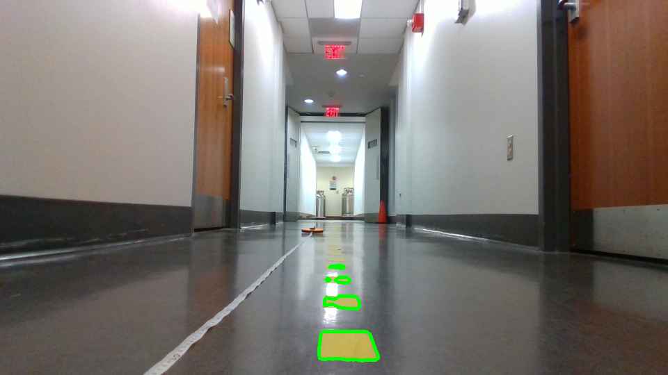
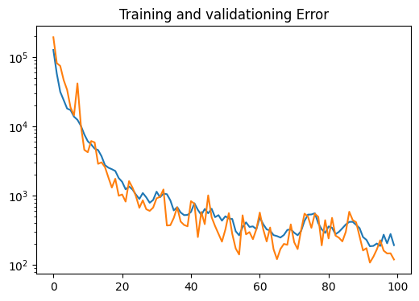

# Lab 8: Vision Lab

## The x, y distance of the unknown cones?
x_car: 0.6135m, y_car: -0.1277m

## Lane Detection Result Image

## Integrated Object Detection + Distance Calculation Result Image
(FILL ME IN)
# What are we supposed to do here?
I could take the bottom left corner of a bounding box of a car (which should be
on the ground), and compute the distance of that point? Are we supposed to do
that?

## Nerual Network Training & Testing Loss Plot

## Is FP16 faster? Why?
FP16 inference time (ms): (FILL ME IN)

FP32 inference time (ms): (FILL ME IN)

You should time only the inference part and average out at least 100 inference cycles.