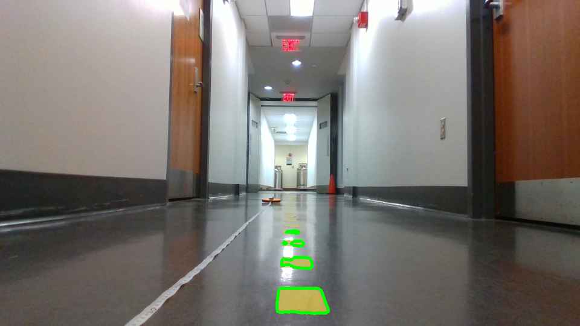
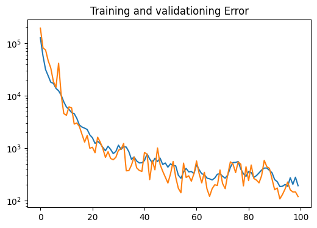

# Lab 8: Vision Lab

## The x, y distance of the unknown cones?
x_car: 0.6135m, y_car: -0.1277m

## Lane Detection Result Image

## Integrated Object Detection + Distance Calculation Result Image
Lab handout doesn't mention this section, so going to ignore for now. As far as
how to approach this, though:
I could take the bottom left corner of a bounding box of a car (which should be
on the ground), and compute the distance of that point?

## Nerual Network Training & Testing Loss Plot

Precision: ~94%

## Is FP16 faster? Why?
FP16 inference time (ms): 19ms

FP32 inference time (ms): 20ms

Int8 inference time (ms): 12ms

Honestly, it doesn't seem like the FP16 model inference was that much faster--it
seemed to average almost the exact same time. In theory, lower precision should
mean faster overall inference, as with smaller values, you should be able to
perform more computations per unit of time. However, in the case of my
GTX1050Ti (Pascal Microarchitecture), I don't think it has dedicated FP16
hardware to do these operations any faster than the usual FP32. That would be my
thinking in regard to why the FP16 and FP32 inference times are so similar.
However, because the 1050 likely has hardware dedicated to integer operations,
it can perform inference almost 2x as fast when the model is quantized into
int8.